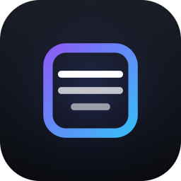

# dsh-figma-plugin



给 [DeepSeek Harness](https://github.com/deepseek-ai/deepseek-harness) 用的 Figma 设计上下文插件。
[English](README.md) | 中文

把一个 Figma 链接丢给 DSH，它就能读懂设计稿：节点的自动布局、尺寸、填充与字体，
节点绑定的设计变量（Design Token），以及一张它真的能看的渲染截图 —— 然后写出与设计一致的 UI 代码。
另外还附带四个把整套工作流固化下来的技能（Skill）。

连接 Figma 只要按一个按钮 —— **不需要申请、复制或粘贴任何 Token**。

这是 Codex 里那个 Figma 插件的 DSH 对应物。相同点与不同点见
[与 Codex Figma 插件的对比](#与-codex-figma-插件的对比)。

## 安装

```sh
dsh plugin --profile web add github:KitanWang/dsh-figma-plugin
```

然后重启 `dsh web`（新增的 bundle 在启动时合成）。需要 Node.js 20+ 与 DeepSeek Harness。

本插件以这个 GitHub 仓库形式分发，即上面那条命令。它没有发布到 npm；
从 GitHub 安装是受支持的方式，插件市场的一键安装走的也是这条路。

## 连接 Figma

打开 **设置 → Figma**，点击「连接 Figma」。浏览器会打开 Figma 官方的登录与授权页面，
你同意后页面就会变成「已连接」，并显示当前使用的是哪个 Figma 账号。

整个流程就这些。插件内置了自己的 Figma OAuth 应用，你不需要注册任何应用，
浏览器里也永远不会出现任何凭据。

已经连接、想换个账号？点「重新连接」即可，它会重新发起一次登录并替换已存的授权。

也可以直接让 Agent 代劳：

> 连接 Figma。

Agent 会调用 `figma_login`，返回一个授权链接让你在浏览器打开。Agent 不会要求你在对话里粘贴 Token。

### 连接是怎么保存的

授权得到的 access / refresh token 以一条凭据 *record*（`figma/oauth`）保存在
Harness 凭据库（`$DSH_HOME/.credentials.yaml`）里，access token 到期前会自动续期。
浏览器只知道「是否已连接」和「连的是哪个账号」—— 拿不到 token、有效期，
也拿不到 OAuth 客户端的任何部分。

**没有个人访问令牌（PAT）这条路。** PAT 意味着让你去 Figma 设置里生成令牌再粘贴进来，
而这正是本插件想消除的麻烦。CI 场景若需要基于令牌的认证，请使用单独的集成。

想显式写配置，就在 profile 的 `cordis.patch.yml`
（`~/.dsh/profiles/web/cordis.patch.yml`）里按 id 覆盖那一行：

```yaml
- id: figma
  config:
    outputDir: .figma
```

## 工具一览

| 工具 | 作用 |
| --- | --- |
| `figma_get_design_context` | **主力工具。** 读取一个节点：紧凑的结构化节点树 + 缩进大纲 + 渲染截图，并把节点绑定的 Figma 变量解析成名字与各模式下的值。 |
| `figma_get_screenshot` | 把一个或多个节点渲染成 PNG/JPG/SVG/PDF，落盘并作为图片附件交给模型查看。 |
| `figma_get_file` | 列出文件的页面与顶层画板 —— 只拿到文件链接时，用它找到要做的节点 id。 |
| `figma_get_variables` | 把文件里的本地变量读成设计 Token：含各模式的值，别名会被解析。可选写出 CSS 和/或 JSON。 |
| `figma_get_styles` | 已发布的填充、文字、效果、网格样式，**并且带实际取值**。 |
| `figma_get_components` | 组件与组件集，含 key、节点 id 和变体属性。 |
| `figma_get_dev_resources` | 节点上挂的开发资源（文档、工单、代码链接）。 |
| `figma_get_comments` | 评论线程及其锚定的节点。 |
| `figma_post_comment` | 在节点或画布位置上发评论。这是对 Figma 的写操作 —— 先跟用户确认。 |
| `figma_whoami` | 验证当前凭据并返回已认证的账号。 |
| `figma_login` | 查看连接状态，或发起 OAuth 授权并返回让你在浏览器打开的链接。 |

所有工具都接受完整 Figma 链接（`url`）或裸文件 key（`fileKey`）；
节点 id 写成 `1-2`（URL 形式）或 `1:2`（API 形式）都可以。
design、旧的 file、proto、FigJam board、Slides 链接都能解析。

### 例子

> 把这个画板实现出来：`https://www.figma.com/design/AbC123/Home?node-id=12-345`

Agent 会调用 `figma_get_design_context`，读大纲和截图，先看仓库里已有的组件和 Token，
再写组件。`figma-design-to-code` 技能负责驱动这个流程。

## 技能（Skills）

四个技能注册进 Harness 全局技能层，因此每个 Agent 和预设都能看到：

| 技能 | 用途 |
| --- | --- |
| `figma-design-to-code` | 高保真实现画板；映射到仓库已有的组件与 Token；对照截图验证。 |
| `figma-design-system` | 盘点变量、样式、组件；产出 Token 与长期有效的规则文档。 |
| `figma-code-connect` | 生成 Code Connect 模板，把 Figma 组件绑定到代码组件。 |
| `figma-design-review` | 把实现与设计稿对比，给出可度量的差异，可选地回写成 Figma 评论。 |

## 配置项

全部可选。

| 配置 | 默认值 | 含义 |
| --- | --- | --- |
| `apiBaseUrl` | `https://api.figma.com` | 走代理时覆盖。 |
| `requestTimeoutMs` | `30000` | 单次请求超时。 |
| `maxRetries` | `2` | 429/5xx 重试次数，遵循 `Retry-After`。 |
| `outputDir` | `.dsh-figma-plugin` | 导出目录；相对路径相对会话工作区解析。 |
| `maxNodes` | `400` | 设计上下文投影的默认节点预算。 |
| `maxDepth` | `8` | 默认深度预算。 |
| `skills` | `true` | 是否注册内置技能。 |
| `scopes` | 见下 | 授权时申请的权限范围，空格分隔。 |
| `redirectUri` | `''` | 重定向地址覆盖值；必须与 Figma 应用配置完全一致。只接受回环地址。 |
| `callbackPath` | `/figma/oauth/callback` | 追加到重定向地址后的回调路径。 |
| `connectionRoutes` | `true` | 是否提供 OAuth 回调与连接页。关闭后只注册工具，不暴露任何 HTTP 接口。 |
| `authorizationUrl` / `tokenUrl` / `refreshUrl` | Figma 官方端点 | 走代理、跑测试或使用 Figma for Government 时可覆盖。 |
| `clientId` / `clientSecret` | 内置值 | 插件自己的 OAuth 应用。只有 fork 或想换用别的应用的部署才需要设置；浏览器既不读取也不写入它们。 |
| `tools` | 全开 | 单工具开关：`whoami`、`file`、`designContext`、`screenshot`、`variables`、`styles`、`components`、`devResources`、`comments`、`postComment`、`login`。 |

默认权限范围为 `current_user:read`、`file_content:read`、`file_metadata:read`、
`file_comments:read`、`file_comments:write`、`file_dev_resources:read`、
`library_content:read`、`library_assets:read`。

只要请求了应用未启用的权限，Figma 就会直接让整个授权失败，所以**上面这些必须全部
在应用的 OAuth scopes 页面勾选**。`file_variables:read` 被刻意排除：Figma 将它标记为
企业版专属，其他套餐根本无法启用，一旦请求就会让登录彻底失败。企业版如需使用
`figma_get_variables`，请在应用上启用该权限，并通过 `scopes` 配置项加上它。

### 插件自带的 OAuth 应用

Figma 的令牌端点用 HTTP Basic（`client_id:client_secret`）认证客户端，且不支持
无需密钥的公开客户端模式，所以「不让用户碰凭据」的插件必须自带一个客户端。
它只放在一个地方 —— [`lib/oauth-app.js`](lib/oauth-app.js)；fork 或部署可以通过配置项
或 `FIGMA_CLIENT_ID` / `FIGMA_CLIENT_SECRET` 覆盖它。

由于 Figma 精确匹配重定向地址，应用必须登记部署可能用到的每一个地址。
GUI 默认端口是 3080：

```
http://127.0.0.1:3080/figma/oauth/callback
http://localhost:3080/figma/oauth/callback
```

如果 GUI 跑在别的端口，该端口的回调地址也需要登记到 OAuth 应用上 —— Figma 精确匹配
重定向地址；授权进行中时，连接页会显示需要登记的确切地址。

### 无头与纯工具部署

没有 web server 的部署（或设置 `connectionRoutes: false`）只注册工具、不注册 HTTP 路由。
此时 `figma_login` 会报告无法登录，工具也会说明 Figma 未连接。
本插件没有令牌兜底：它只通过自己的 OAuth 授权认证。

## 安全说明

- OAuth 回调是一条普通 HTTP 路由，**刻意不套用** Harness 的跨站 API 防护栅栏：
  Figma 是把浏览器以顶层跨站导航 302 回来的，那个栅栏会直接拒绝。因此这条路由的认证
  就是 `state` —— 进程内生成的 32 字节随机值，常量时间比较，且必须命中一个待处理的授权尝试。
- 所有会改状态的接口都限定同源 POST。缺少 `Origin` 头的请求一律拒绝，而不是放行；
  请求体也无法用来替换客户端凭据。
- 浏览器永远拿不到 access token、refresh token 或 OAuth 客户端的任何部分。状态接口
  只返回 `connected`、`available` 与待处理授权的状态 —— 测试里有针对泄漏的断言。
  测试套件里有针对泄漏的断言。
- 重定向地址必须是回环 http(s) 地址，一次性授权码不会发往本进程不拥有的主机。
- Figma 的授权码 30 秒即过期，所以换取令牌发生在回调请求内部、且在 await 任何其他操作之前。

## 与 Codex Figma 插件的对比

Codex 那个插件是三样东西拼起来的：`.codex-plugin/plugin.json` 清单、
一个 app 连接器（`.app.json` → Figma 托管的 MCP Server），
以及一堆 skill / agent / command / 写后钩子。设计智能本身在 Figma 的 MCP Server 里，
插件主要是接线加提示词素材。

DSH 有同样的**原语** —— 技能注册表（`ctx.skills`）、工具注册表（`ctx.tools`）、
子 Agent，以及 MCP 桥（`@deepseek-ai/dsh-mcp-client`）—— 但没有针对 Figma 打包好的东西。
本插件用原生方式补上这个空缺，而不是去代理 Figma 的 MCP Server，
因此不需要开着 Figma 客户端：

| | Codex + Figma 插件 | dsh-figma-plugin |
| --- | --- | --- |
| 读设计 | Figma MCP Server（OAuth） | Figma REST API（OAuth） |
| 登录方式 | 浏览器授权，由 Figma 托管页面 | 浏览器授权，由 Figma 托管页面 |
| OAuth 客户端 | Figma 自己的，随连接器分发 | 插件自己的，内置在 `lib/oauth-app.js` |
| 用户需要处理的凭据 | 无 | 无 |
| 凭据存储 | 连接器自行管理 | Harness 凭据库（`records`），自动续期 |
| 需要开着 Figma 桌面端 | 否（托管 MCP） | 否 |
| 技能 | 7 个，Figma 官方撰写 | 4 个，针对这些工具重写 |
| 设计 Token | 走 MCP 的 `get_variable_defs` | `figma_get_variables`（多模式 + 别名解析 + CSS/JSON 导出） |
| Code Connect | MCP + Figma CLI | 技能指导生成模板；用 Figma CLI 发布 |
| 写回画布 | 支持（MCP + Plugin API） | **不支持** —— 见下 |
| 上手成本 | 装插件、授权 Figma | 装插件、注册一个 OAuth 应用、点「保存并连接」 |

### 为什么要自己注册 OAuth 应用

Figma 的令牌端点用 HTTP Basic（`client_id:client_secret`）认证客户端；PKCE 虽然支持，
但不能替代 Secret。如果把 Secret 随插件分发，任何安装者都能读到，所以每个用户自己注册一次。
另外 Figma 把托管 MCP 的动态客户端注册限制在 MCP Catalog 名单内的客户端，
第三方插件无法凭空申请到一个共享客户端。

### 也想要 Figma 官方的 MCP 工具？

两者可以共存。把 Harness 的 MCP 桥指向 Figma 本地的 Dev Mode Server
（Figma 桌面端 → Preferences → **Enable Dev Mode MCP Server**），
就能在 `figma_*` 之外再拿到一组 `mcp__figma__*` 工具：

```yaml
# ~/.dsh/profiles/web/cordis.patch.yml
- insert:
    - id: figma-devmode-mcp
      name: '@deepseek-ai/dsh-mcp-client'
      config:
        transport: streamable-http
        serverName: figma
        url: http://127.0.0.1:3845/mcp
        headers: {}
        toolCallTimeoutMs: 60000
        failOnStartupError: false
```

这是最接近 Codex app 连接器的等价物，也是你确实需要「写回画布」时该走的路。
MCP 桥的 HTTP 传输只支持自定义 header，没有 OAuth 流程，
所以 Figma 的**托管** MCP 端点（`https://mcp.figma.com/mcp`）需要你自己准备 bearer token 才能用。

## 已知限制

- **不能写回画布。** 在 Figma 里创建或修改节点只能通过 Plugin API（跑在 Figma 内部）
  或 Figma 的 MCP Server。需要的话用上面的 MCP 桥。本插件是只读的。
- **变量接口需要 Figma 企业版。** `figma_get_variables` 调的接口仅对企业组织正式成员开放。
  套餐不够时会明确报错；`figma_get_styles` 仍然可用。
- **Code Connect 是「指导」而非「自动化」。** Figma REST API 里没有 Code Connect 接口。
  技能负责读组件清单并写出模板文件；发布交给 Figma CLI。
- **导出会落盘。** 截图写在 `outputDir`（默认 `<工作区>/.dsh-figma-plugin/`）下，
  记得加进 `.gitignore`。当当前模型支持图片输入时，图片也会同时作为附件内联。
- **限流是 Figma 的。** 客户端会对 429/5xx 退避重试，但逐节点遍历大文件仍可能触发限流。
- **登录需要凭据库与 web server。** 两者在默认的 web profile 里都有。
  纯工具组合仍会注册工具，但无法登录，并且会明确说明。
- **内置的 OAuth Secret 是公开的。** 任何安装此包的人都能读到。它只授予上面列出的权限范围，
  部署可以通过配置项或环境变量换成自己的客户端来轮换。
- **重定向端口必须已登记。** Figma 精确匹配重定向地址，而回调路由就跑在 GUI 自己的
  server 上，所以用 `--port` 启动的 GUI 必须先把该端口的回调地址加进 OAuth 应用才能完成
  登录。授权进行中时，连接页会显示需要登记的确切地址。

## 开发

```sh
npm test                        # 116 个单元 + 集成测试，不联网
node scripts/smoke.mjs          # 在真实 Cordis 上下文中挂载并断言注册结果
node scripts/routes-smoke.mjs   # 对着真实 WebServer 跑一遍 OAuth 路由
```

`npm test` 会在本地起一个桩 Figma API，因此整套工具面 —— 认证头、查询构造、
渲染、写文件、Token 导出 —— 都不需要 Figma 账号就能跑通。OAuth 部分由三层覆盖：
纯函数测试（含 RFC 7636 的 PKCE 测试向量）、基于内存凭据库的状态机测试，
以及回调与面板路由的 HTTP 测试。

`scripts/smoke.mjs` 会把插件挂在 Harness 真实的 `ToolRuntime`、`SkillRegistry`、
`SystemPrompt` 服务旁边，断言工具、技能和提示词段落都注册成功。
`scripts/routes-smoke.mjs` 更进一步：它挂载真实的 `WebServer` 与一个凭据 provider，
然后通过 HTTP 驱动连接接口，断言重定向地址用的是实际端口、跨源「连接」请求被拒、
伪造的 `state` 回调失败，并且没有任何凭据穿过网络。

插件没有构建步骤，除 Harness 自身的包之外没有运行时依赖。
`lib/client.js` 是按模块加载器 factory 形式手写的纯浏览器 JavaScript，因此不需要打包器。

## 许可

MIT，见 [LICENSE](LICENSE)。
